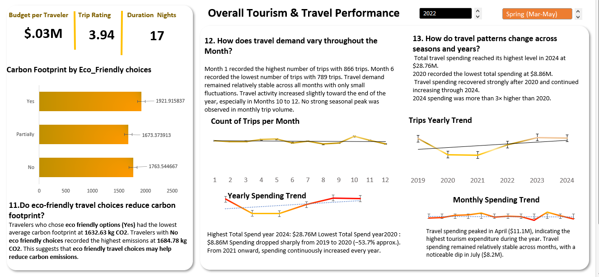
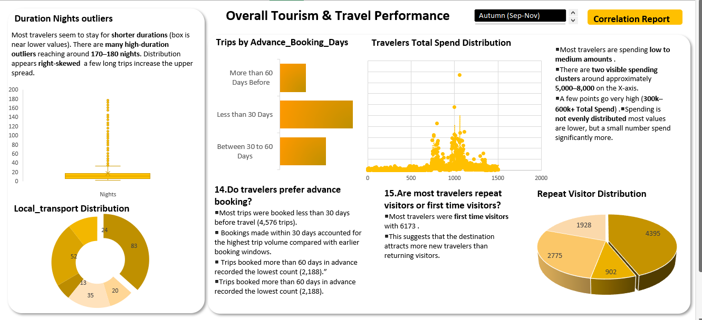
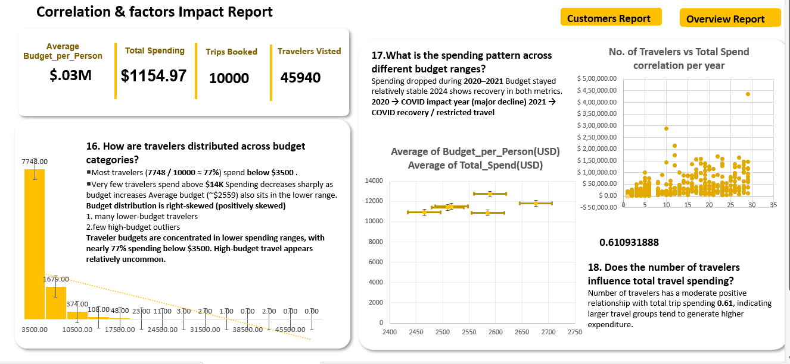

# Tourism-dataset-2019-2024
Analyzed 10,000 global travel records (2019–2024) to uncover trends in traveler spending, behavior, budgeting, satisfaction, and tourism patterns using Excel and statistical analysis.

## Global Tourism & Traveler Behavior Analysis

This project explores global tourism and travel patterns from 2019–2024 using Excel, statistical analysis, and data visualization techniques. The analysis focuses on understanding traveler spending behavior, budget distribution, booking trends, satisfaction levels, sustainability factors, and the impact of travel decisions on overall expenditure.

Using 10,000 travel records and 33 features, this project applies exploratory data analysis (EDA), correlation analysis, descriptive statistics, histograms, scatter plots, and interactive dashboards to transform raw data into meaningful business insights and support data-driven decision-making.

## Key Highlights
- Analyzed traveler spending and budget behavior
- Explored tourism trends across multiple years including COVID impact
- Performed correlation analysis to identify relationships between variables
- Built interactive Excel dashboards and statistical visualizations
- Generated insights through data storytelling and business interpretation

**Tools Used: Excel | Statistics | Data Visualization | Dashboarding**

# Dashboard Preview
# Dashboard Screenshots

📊 [Overview Dashboard](./Overview.png)
[Overview Dashboard](./Overview2.png)

## Overview

📊 [Customer Preference Analysis](./Customer%20Preference.png)
## Customer Preference

📊 [Customer Satisfaction](./Customer%20Satisfaction.png)
## Customer Satisfaction

📊 [Customer Satisfaction Dashboard](./Customer%20Satisfaction2.png)
## Customer Satisfaction Analysis

📊 [Correlation Analysis](./Correlation.png)
## Correlation Analysis

